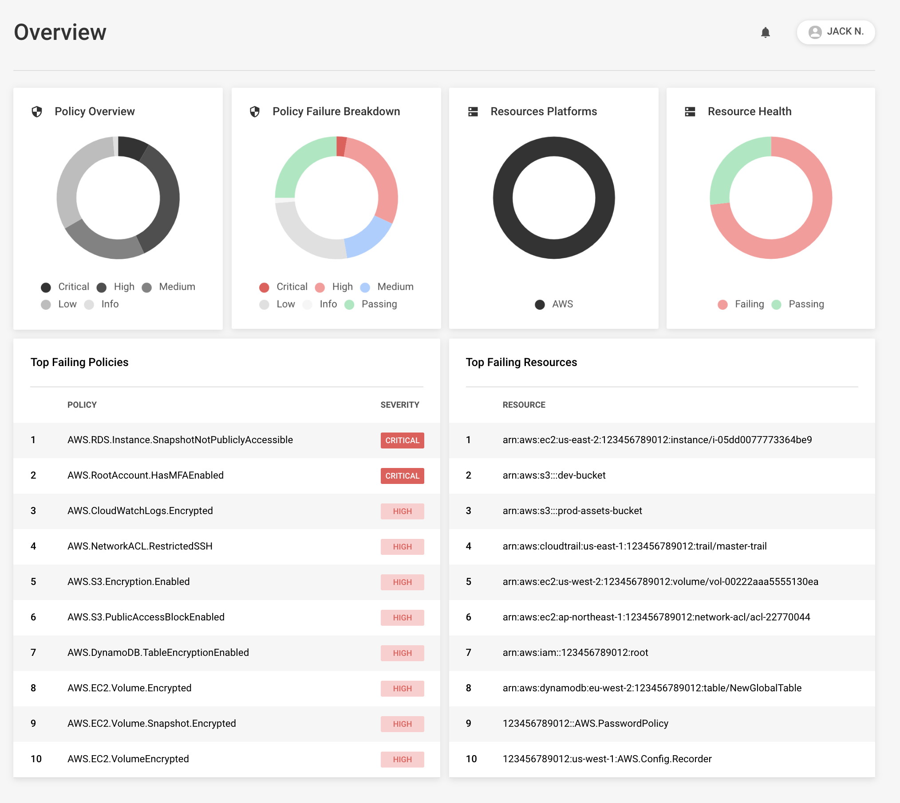
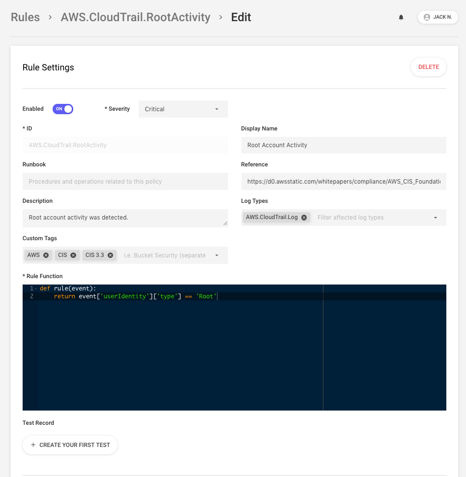
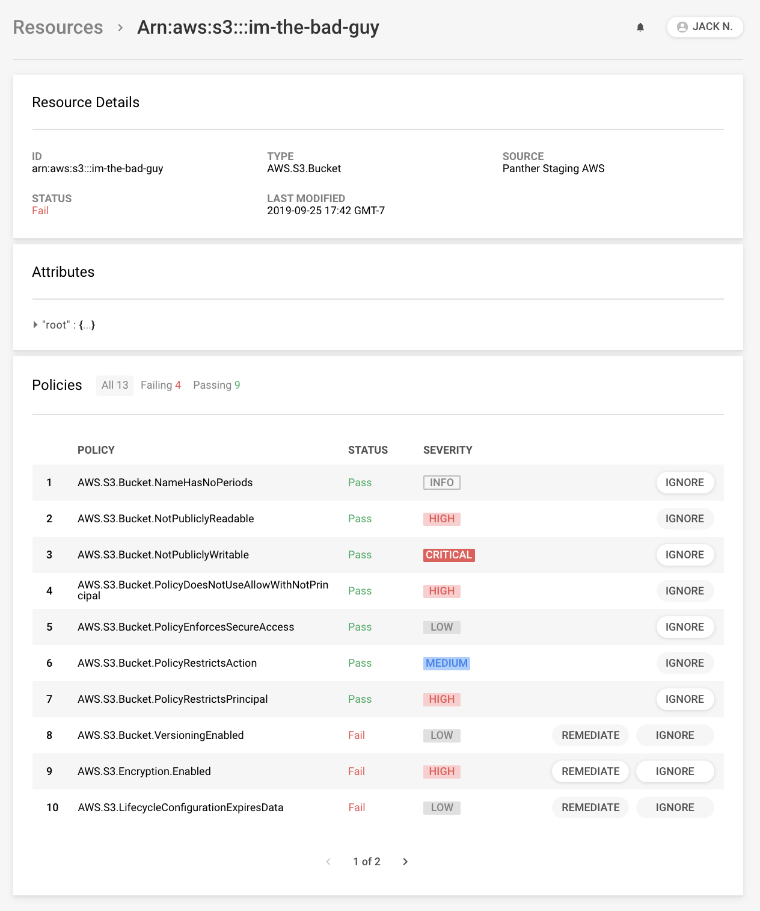

<p align="center">
  <a href="https://www.runpanther.io"></a>
</p>

<p align="center">
  <b>A Cloud-Native SIEM for the Modern Security Team</b>
</p>

<p align="center">
  <a href="https://docs.runpanther.io">Documentation</a> |
  <a href="https://blog.runpanther.io">Blog</a>
</p>

<p align="center">
  <a href="https://gitter.im/runpanther/community?utm_source=badge&utm_medium=badge&utm_campaign=pr-badge"></a>
  <a href="https://magefile.org"></a>
  <a href="https://circleci.com/gh/panther-labs/panther"></a>
</p>

---

## Why Panther?

Panther is developed by a [dedicated team](https://runpanther.io/about/) of cloud security practitioners and is designed to be:

- **Flexible:** Perform advanced analysis on log data and cloud infrastructure with Python-based detections
- **Automated:** Fast and simple deployments with AWS CloudFormation
- **Scalable:** Built on Serverless technology for cost and operational efficiency at any scale
- **Secure:** Least-privilege and encrypted infrastructure deployed into your cloud
- **Integrated:** Analyze popular security logs, gather information about your cloud resources, and send alarms to commonly used destinations

## Use Cases

- **SIEM:** Centralize all security log data for threat detection, historical search, long-term storage, and investigations
- **[Log Analysis](https://runpanther.io/log-analysis):** Detect suspicious activity quickly and effectively with Python rules
- **[Cloud Compliance](https://runpanther.io/compliance/):** Detect and enforce AWS infrastructure best practices with Python policies
- **Alerting:** Send notifications to your team when new issues are identified
- **Automatic Remediation:** Correct insecure infrastructure as soon as new issues are identified

_NOTE: Panther is currently in beta._

## Screenshots

**Compliance Overview**



**Rules Editor**



**Resource Viewer**



## Deployment

Panther is deployed from within your AWS account. Follow our [Quick Start guide here](https://docs.runpanther.io/quick-start) to quickly get up and running!

## Development

Since the majority of Panther is written in Go, we follow the [standard Go project layout](https://github.com/golang-standards/project-layout).

Run `mage` to see the list of available commands (`-v` for verbose mode). You can easily chain `mage` commands together, for example:

```bash
mage fmt test:ci deploy
```

### Testing

1. Run backend test suite: `mage test:ci`
2. Run frontend test suite: `npm run lint`
3. Run integration tests against a live deployment: `mage test:integration`
   - WARNING: Integration tests will erase all Panther data stores
   - To run tests for only one package: `PKG=./internal/compliance/compliance-api/main mage test:integration`

## Contributing

We welcome contributions! Please read the [contributing guidelines](https://github.com/panther-labs/panther/blob/master/docs/CONTRIBUTING.md) before submitting pull requests.

## License

Panther is dual-licensed under the AGPLv3 and Apache-2.0 [licenses](https://github.com/panther-labs/panther/blob/master/LICENSE).
