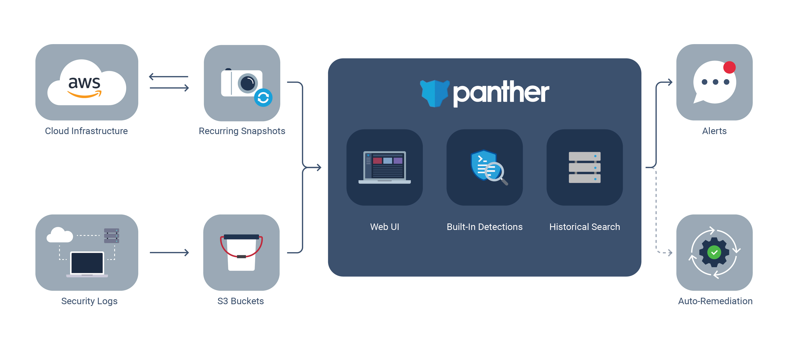

# Home

*Panther detects threats with log data, improves cloud security posture, and powers investigations with a robust data warehouse.*

## Architecture

The three main components in Panther are:

* **Log Analysis** to centralize, parse, and analyze log data
* **Cloud Security** to detect misconfigurations and improve cloud security posture in AWS accounts
* **Historical Search** for analytics on collected log data and alerts

## Benefits

The benefits of Panther include:

- Flexible Python3-based detections
- Built on serverless technologies for high scale at low cost
- Near real-time analysis for quick alerting and remediation
- Simple deployments using infrastructure as code
- Secure, least-privilege, and encrypted infrastructure deployed within your AWS account

## Use Cases

Security teams can use Panther for:

|         Use Case         | Description                                                                               |
| :----------------------: | ----------------------------------------------------------------------------------------- |
|  Continuous Monitoring   | Analyze logs in real-time and identify suspicious activity that could indicate a breach   |
|       Alert Triage       | Pivot across all of your security data to understand the full context of an alert         |
|      Searching IOCs      | Quickly search for matches against IOCs using standardized data fields                    |
| Securing Cloud Resources | Identify misconfigurations, achieve compliance, and model security best practices in code |

## Concepts

|         Term         | Meaning                                                                               |
| :----------------------: | ----------------------------------------------------------------------------------------- |
| Event   | A normalized log from sources such as CloudTrail, Osquery, or Suricata   |
| Rule       | A Python function to detect suspicious activity         |
| Alert   | A notification to the team when a policy has failed or a rule has triggered  |
| Policy | A Python function representing the desired secure state of a resource |
| Resource      | A cloud entity, such as an IAM user, virtual machine, or data bucket                    |

## Get Started!

To get set up with Panther, continue to the [Quick Start](quick-start.md) on the next page.
