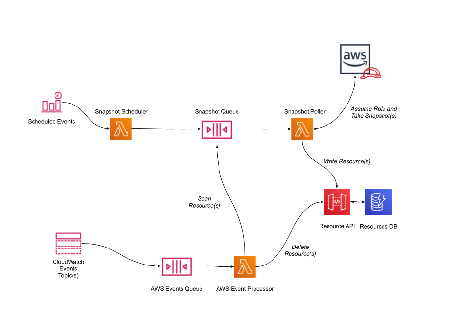

# Cloud Security

Panther's Cloud Security works by scanning AWS accounts, modeling the **Resources** within them, using **Policies** to detect misconfigurations, and optionally remediating vulnerable resources.

Common security misconfigurations include:

- S3 Buckets without encryption
- Security Groups allowing inbound SSH traffic from `0.0.0.0/0`
- Access Keys being older than 90 days
- IAM policies that are too permissive

## How It Works

When adding a new AWS account for infrastructure monitoring, Panther first conducts a baseline scan and models resources in your account.

Account scans are performed daily to ensure the most consistent state possible. This works by using an assumable IAM Role with ReadOnly permissions.

Resources can also be tracked in real-time using CloudTrail or [CloudWatch Events](https://docs.aws.amazon.com/AmazonCloudWatch/latest/events/WhatIsCloudWatchEvents.html).
