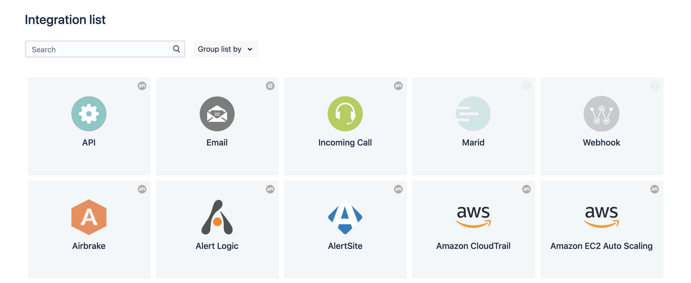
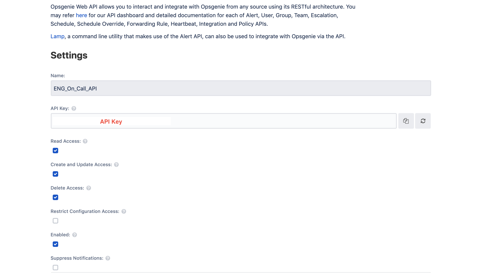

# OpsGenie

This page will walk you through configuring OpsGenie as a Destination for your Panther alerts.

The OpsGenie Destination requires an `Opsgenie API key`. When an alert is forwarded to an OpsGenie Destination, it creates an incident using the specified API key:

To configure an OpsGenie Destination, start by navigating to your team's dashboard by going to the Teams tab and selecting the team to receive the alert:

After selecting the team you to which you wish to send alerts, select the integrations tab on the left:

Select the `Add integration` button:

Next select the `API` integration type from the integration list:

After selecting the API integration type, you will be prompted to configure the name, settings, permissions, etc. of the integration. Be sure to leave the `Enabled` and `Create and Update Access` check boxes checked:

Copy the API key out of the configuration settings and into the Panther Destinations configuration, and select the `Save Integration` button. Your OpsGenie Destination should now be ready to receive alerts from Panther
