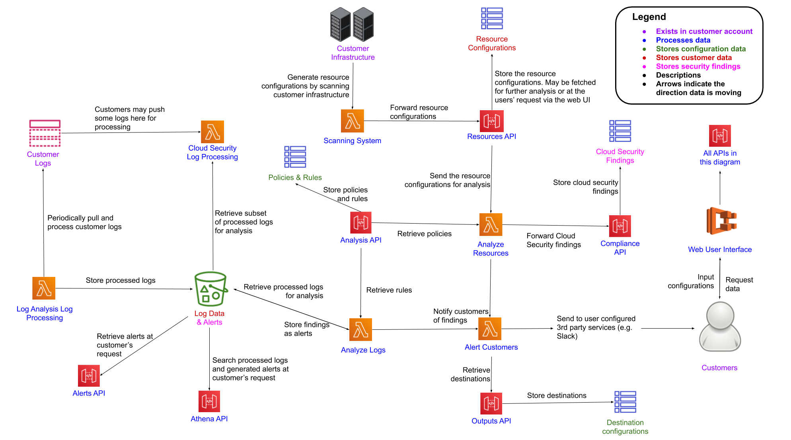

# Development

Panther is a collection of serverless applications deployed within your AWS account. The frontend is a React application which runs in a Docker container \(via ECS\), and the backend is a collection of compute \(Lambda\), storage \(DynamoDB / S3\), and other supporting services.

The sections below provide guidance on how to extend Panther to meet your individual needs.

## Architecture Diagram

This diagram provides an overview of the core components of Panther, and how they are connected.


This diagram has been simplified to just the core components of Panther. For a slightly more detailed architecture diagram, see the bottom of this page.

## Environment

You can use the Docker environment from the [quick start](quick-start.md#deployment) instructions for development. However, it's faster to compile and test the code locally.

### Dependencies

Install [Go](https://golang.org/doc/install#install) 1.13+, [Node](https://nodejs.org/en/download/) 10+, and [Python](https://www.python.org/downloads/) 3.7+.

For MacOS w/ homebrew:

```bash
brew install go node python3
```

Add go tools to your environment:

```bash
export GOPATH=$HOME/go PATH=$PATH:$GOPATH/bin
```

Install the [AWS CLI](https://docs.aws.amazon.com/cli/latest/userguide/install-cliv1.html), which usually works best with the [bundled installer](https://docs.aws.amazon.com/cli/latest/userguide/install-bundle.html):

```bash
curl "https://s3.amazonaws.com/aws-cli/awscli-bundle.zip" -o "awscli-bundle.zip"
unzip awscli-bundle.zip
sudo ./awscli-bundle/install -i /usr/local/aws -b /usr/local/bin/aws
```

Install [Docker](https://docs.docker.com/install/) and make sure the daemon is running in the background.

Install [Mage](https://magefile.org/#installation):

```bash
go get github.com/magefile/mage
```

Finally, install the remaining development libraries:

```bash
mage setup
```

### Mage

Panther uses [mage](https://magefile.org/), a Go tool similar to `make` , to manage the development lifecycle.

Run `mage` from the repo root to see the list of available commands:

```text
Targets:
  build:api           Generate API source files from GraphQL + Swagger
  build:cfn           Generate CloudFormation templates in out/deployments folder
  build:lambda        Compile Go Lambda function source
  build:tools         Compile devtools and opstools
  clean               Remove dev libraries and build/test artifacts
  deploy              Deploy Panther to your AWS account
  doc                 Auto-generate specific sections of documentation
  fmt                 Format source files
  glue:sync           Sync glue table partitions after schema change
  glue:update         Updates the panther-glue cloudformation template (used for schema migrations)
  setup               Install all build and development dependencies
  show:schemas        Prints to stdout a JSON representation each supported log type
  teardown            Destroy all Panther infrastructure
  test:ci             Run all required checks for a pull request
  test:integration    Run integration tests (integration_test.go,integration.py)
```

You can easily chain `mage` commands together, for example: `mage clean setup test:ci deploy`

## Testing

1. Run our test suite: `mage test:ci`
2. Run integration tests against a live deployment: `mage test:integration`
   - **WARNING**: integration tests will erase all Panther data stores
   - To run tests for only one package: `PKG=./internal/compliance/compliance-api/main mage test:integration`

## Deploying and Updating

To update your deployment of Panther, follow the steps below:

1. Checkout the latest release:
   1. `git fetch origin master`
   2. `git checkout tags/v1.1.1`
2. Clean the existing build artifacts: `mage clean`
3. Deploy the latest application changes: `mage deploy`

## Repo Layout

Since the majority of Panther is written in Go, the repo follows the standard [Go project layout](https://github.com/golang-standards/project-layout):

|         Path         | Description                                                                               |
| :----------------------: | ----------------------------------------------------------------------------------------- |
| [**api**](https://github.com/panther-labs/panther/tree/master/api)   | Input/output models for communicating with Panther's backend APIs |
| [**build**](https://github.com/panther-labs/panther/tree/master/build)   | Dockerfiles for CI and deployment |
| [**cmd**](https://github.com/panther-labs/panther/tree/master/cmd)   | Go dev and ops tools |
| [**deployments**](https://github.com/panther-labs/panther/tree/master/deployments)   | CloudFormation templates for deploying Panther itself or integrating the accounts you want to scan   |
| [**docs**](https://github.com/panther-labs/panther/tree/master/docs)  | Documentation, license headers, README, images, code of conduct, etc  |
| [**internal**](https://github.com/panther-labs/panther/tree/master/internal) | Source code for all of Panther's Lambda functions  |
| [**pkg**](https://github.com/panther-labs/panther/tree/master/pkg)  | Standalone Go libraries that could be directly imported by other projects |
| [**tools**](https://github.com/panther-labs/panther/tree/master/tools)  | Magefile source and other build infrastructure  |
| [**web**](https://github.com/panther-labs/panther/tree/master/web)   | Source for the Panther web application  |

## Additional Diagrams

Here are some additional diagrams to supplement the high level architecture diagram above.

### Detailed architecture diagram

Here is a slightly more detailed version of essentially the same architecture diagram as above.


While more detailed than the overview above, this diagram also simplifies some implementation details for clarity. For example, the majority of lambdas are not invoking each other directly but instead communicating via SQS Queues or DynamoDB streams. 

### Data flow diagram

This diagram focuses on where and how your data is being stored and processed, as opposed to which systems are interacting and why.



It is important to note here (as the legend says) that the arrows are indicating the direction that data is being transferred, as opposed to the previous diagrams where arrows are indicating the direction that communication is being initiated from.
