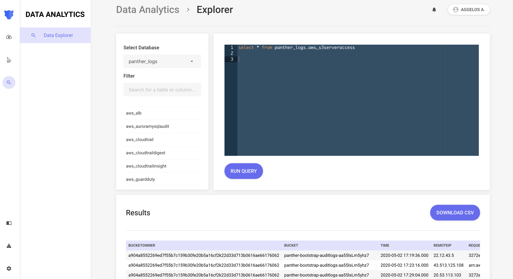

# Data Explorer
Data explorer gives Panther Enterprise deployments access to a panel where they can perform SQL queries on their Panther
data, in a similar fashion to AWS Athena. Panther expands upon the latter, by adding a cleaner
UI, a more robust computing engine, persistence and autocomplete goodies that will enhance the
 querying experience.

With Panther Data Explorer, you are able to:

* Browse their databases, populated tables & related columns
* Issue SQL queries against their logs
* View query results in a friendly way
* Share results with their team through a shareable link
* Download results in a CSV

As with all of our enterprise features, access to the Data Explorer can be limited through our 
[Role-Based Access Control](./rbac.md) system.

