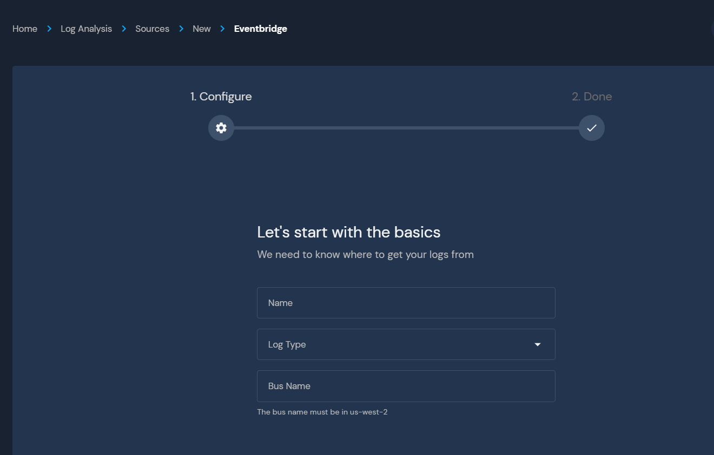

# SaaS Logs

Panther Enterprise supports pulling logs directly from SaaS platforms such as Okta, OneLogin, and more.

The two mechanisms used are direct integrations by querying APIs directly and using AWS EventBridge.

## Direct Integration

Supported direct SaaS integrations include:
* Okta
* G Suite
* Box
* More coming soon!

To set up, head to `Log Analysis` > `Sources` > `ADD SOURCE`, and select one of the integrations listed.

## EventBridge Integrations

Panther has direct support for pulling log data from AWS EventBridge, enabling real-time streaming and simple ingestion of [support SaaS integrations](https://aws.amazon.com/eventbridge/integrations/).

* OneLogin
* Auth0
* NewRelic
* ZenDesk

To set up, head to `Log Analysis` > `Sources` > `ADD SOURCE` and select `Amazon EventBridge`:

