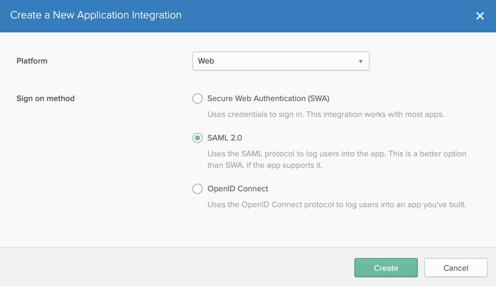
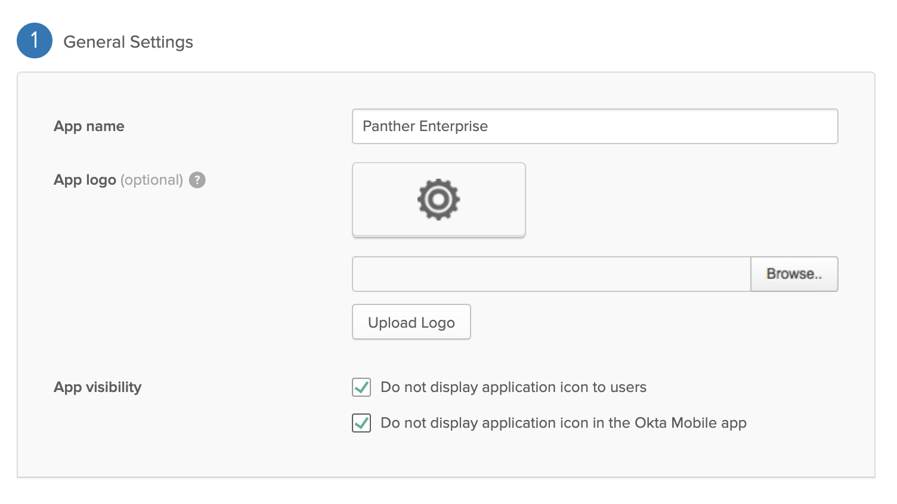
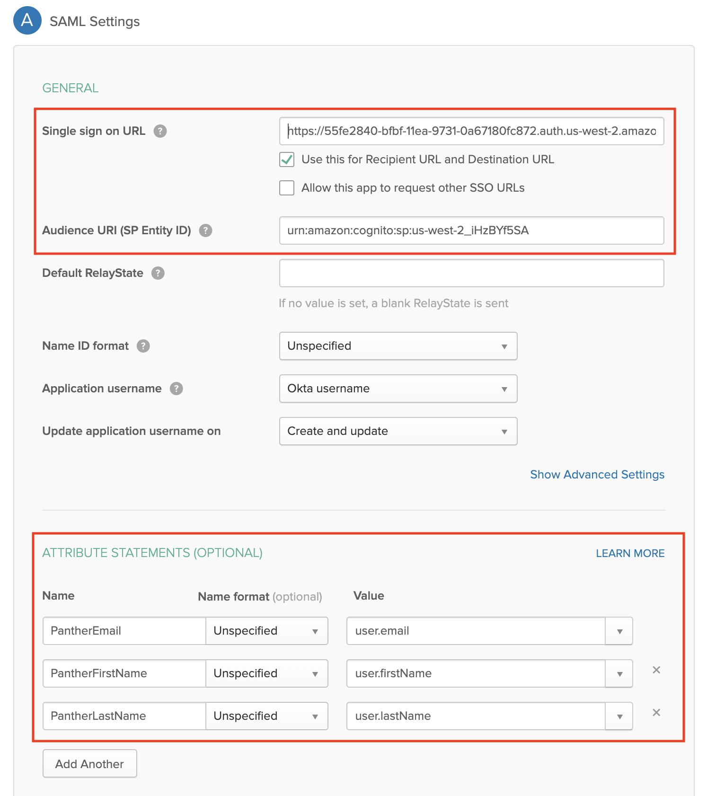

# Integrating Okta with Panther Enterprise

First, [deploy](../../quick-start.md) Panther Enterprise and go to the settings page to find your Cognito user pool ID and domain.

In these examples,

* `us-west-2` is my AWS deployment region
* `us-west-2_iHzBYf5SA` is my Cognito user pool ID
* `https://55fe2840-bfbf-11ea-9731-0a67180fc872.auth.us-west-2.amazoncognito.com` is my Cognito domain

## Create Okta App


We are in the process of registering an official Panther Okta app, but in the meantime follow these steps to configure an Okta app manually.


From the Okta admin console, navigate to the Applications tab

Click "Add Application"

Click "Create New App" and configure "Platform: Web" app and "Sign on method: SAML 2.0"

Click "Create" and configure the General Settings however you see fit. We recommend:

Click "Next" and configure section 2A, "SAML Settings", as follows:

* The "Single sign on URL" is of the form `https://USER_POOL_HOST/saml2/idpresponse`, where `USER_POOL_HOST` is replaced with your Cognito user pool domain, found in the Panther settings page. In this example, the full URL is `https://55fe2840-bfbf-11ea-9731-0a67180fc872.auth.us-west-2.amazoncognito.com/saml2/idpresponse`
* The "Audience URI" is of the form `urn:amazon:cognito:sp:USER_POOL_ID`, where `USER_POOL_ID` is replaced with your Cognito user pool ID, found in the Panther settings page.
* The "Group Attribute Statements" can be left blank (not shown here)

Click "Next" and fill out feedback for Okta, linking to this documentation page if you like. Click "Finish."

Copy the "Identity Provider metadata" link shown on the next screen, under the Settings section of the "Sign On" tab:

This is the "issuer/metadata" link that you will need to give to Panther.

## Configure Panther

From the Panther settings page, enable SAML with:
  * A default [Panther role](../rbac.md) of your choice
  * The Okta metadata URL you just copied
  
Click "save" and you're done! Now, the Panther login page will show a link which will authenticate via Okta.


Screenshots coming soon!
