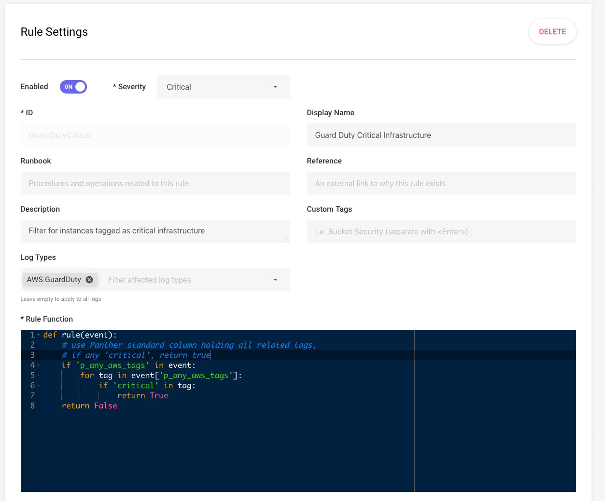

# Panther standard fields

Panther log processing appends some fields to all log records. This fields provide
standard names for attributes over all data sources allowing within and between
data source correlation of data.

All appended standard fields begin with "p\_".

# Required fields

## p_log_type string

The type of log.

## p_row_id string

Unique id (UUID) for the row.

## p_event_time timestamp

The associated event time for the log type is copied here and normalized to UTC.

# The "any" fields

A common security question is often of the form “Was <insert indicator> ever observed in our logs?”
Notice that the relationship of the indicator is not a concern initially, simply the presence or absence of activity is of interest.
To allow this question to be answered over all data sources the "any" fields below are appended to rows of data as appropriate.

The "all_logs" view is provided over all data sources to make queries easy for users to find activity for an indicator in a single query.

## p_any_ip_addresses ([string,string…])

List of ip addresses (v4 or v6 in string form) related to row.

## p_any_domain_names ([string,string…])

List of domain names related to row.

## p_any_aws_account_ids ([string,string…])

List of was account ids related to row.

## p_any_aws_instance_ids ([string,string…])

List of was instance ids related to row.

## p_any_aws_arns ([string,string…])

List of arns related to row.

## p_any_aws_tags ([string,string…])

List of tags related to row as "key:value: pairs.

# Using the "all_logs" view to search all logs at once

Panther manages an Athena view over all data sources using the Panther standard fields.
This allows you to ask questions like "Was there ANY activity from some-bad-ip and if so where?".
For example this will show how many records by log type that was associated with IP address 1.2.3.4:

```

SELECT
 p_log_type, count(1) as row_count
FROM panther_views.all_logs
WHERE year=2020 and month=1 and day=31 and contains(p_any_ip_addresses, '1.2.3.4')
GROUP BY p_log_type

```

From this information you can then explore the particular logs where activity is indicated.

# Standard fields can be used in rules

The Panther standard fields can be used in rules. For example, this rule triggers when any
GuardDuty alert is on a resource tagged as 'critical':


