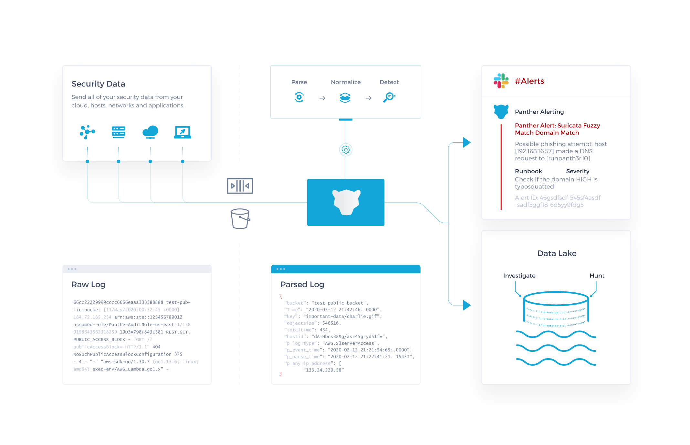

# Log Analysis

Panther's Log Analysis is used to detect threats in [log data](log-processing/supported-logs).

This works by parsing, normalizing, and analyzing high volumes of data in real-time. In order to onboard into this pipeline, data must send to either an S3 bucket or a SQS queue.

Common events analyzed with log analysis include:
* Authorization or authentication
* API calls
* Network traffic
* Running processes
* Alerts from IDS

## How It Works

1. Logs are written into an S3 bucket
2. The bucket sends an event notification to Panther's SNS Topic
3. Panther receives the event notification, assumes an IAM Role, and downloads the log data
4. The parsed log data is forwarded for analysis
