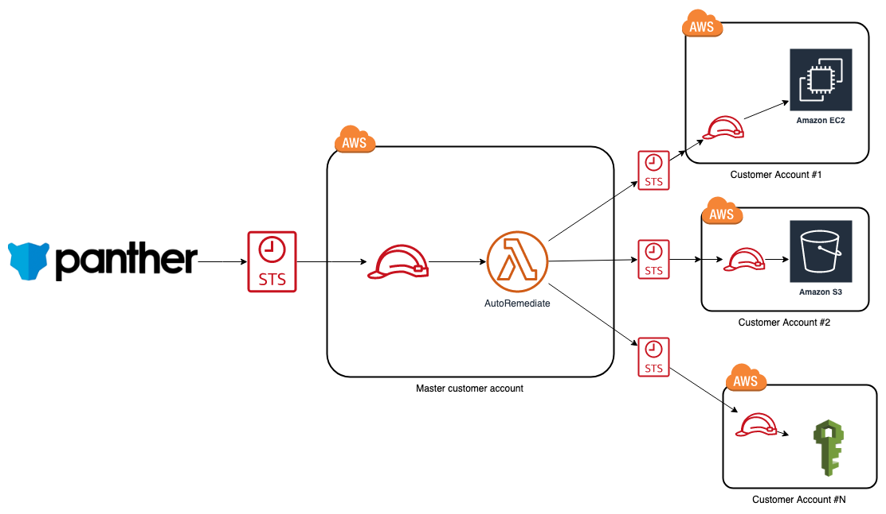

# Automatic Remediation

## Overview

Panther supports Automatic Remediation of non-compliant resources to ensure that your infrastructure is as secure as possible. This works by:

- Associating a remediation with a given Policy
- When a Policy failure occurs, the `aws-remediation` Lambda assumes a role in the target account with the offending resource and performs the remediation

The following diagram shows how Panther supports Automatic Remediation:

## Setup

Enabling automatic remediation for a Cloud Security source is simple. The only requirement is to check the `AWS Automatic Remediations` checkbox while on-boarding the Cloud Security source, and the pre-requisite role will be deployed as part of the on-boarding stack.

To enable automatic remediation on an existing source, go to your sources list and edit the existing source for which you wish to enable automatic remediation. This will bring you to the same setup wizard as above, with instructions on how to deploy the updated stack template.

## Usage

Using automatic remediation requires you to configure an automatic remediation on a policy. By default, Panther ships with no automatic remediations configured to be as safe as possible when onboarding new accounts. To configure an automatic remediation for a given policy, perform the following steps.

First, navigate to `Cloud Security` > `Policies` and click the policy for which you intend to enable an automatic remediation. This will bring you to the `Policy details` page, from here click the `Edit` button to get to the `Policy edit` page.

Navigate to the bottom of this page to find the automatic remediation configuration options.

From the `Remediation` dropdown, select the remediation you wish to enable for this policy. Some remediations may support or require configurations to be set. On the following pages, you will find more detailed descriptions of each available remediation and their configuration settings. Once you have selected and configured the appropriate remediation, click the `Update` button.

Now, all future failures of the policy will automatically be re-mediated with the selected remediation. In order to apply the remediation to already detected failures, you can select the `Remediate` button on a failing resource when viewing the resources for the policy.

In order to apply the remediation to all currently failing resources, simply disable the policy then re-enable the policy to re-evaluate all resources immediately with the automatic remediation in place. Panther doesn't do this automatically for safety reasons. This way you are able to enable an automatic remediation, test it out on a few resources to make sure everything is working as intended, then apply it to all failing resources (if desired) with the confidence that the exact policy and remediation configurations you intend to carry out are working as intended.