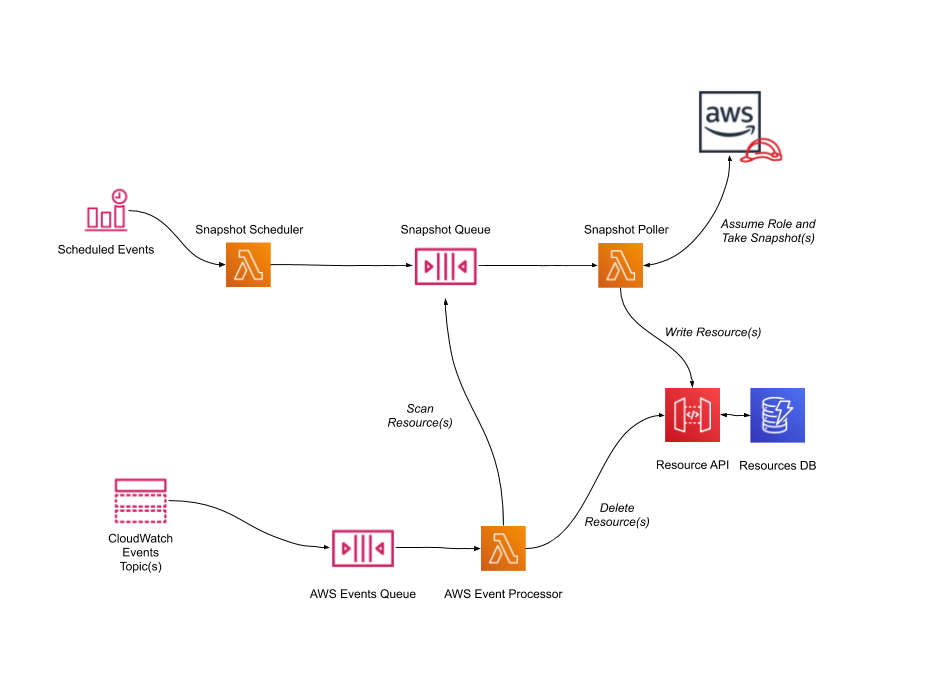
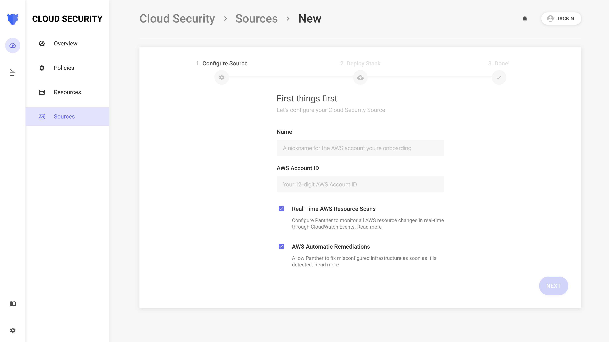
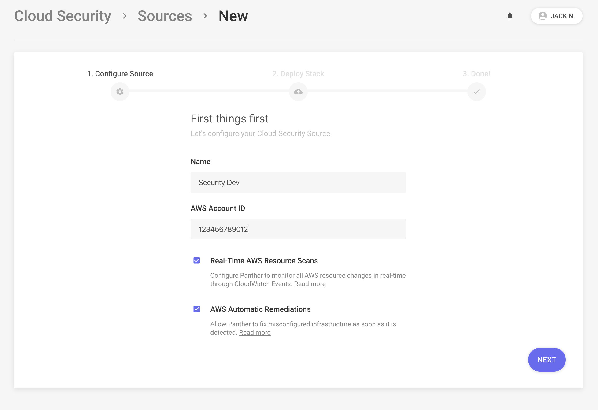
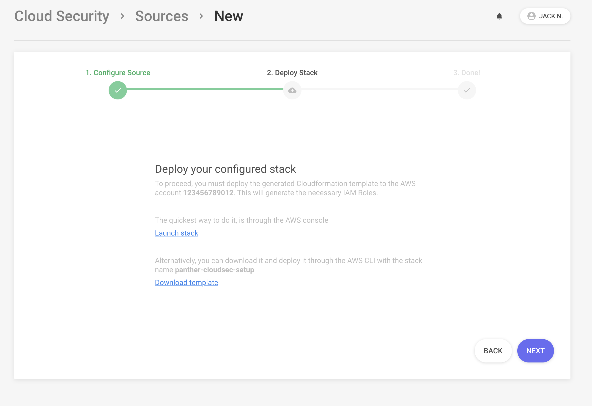
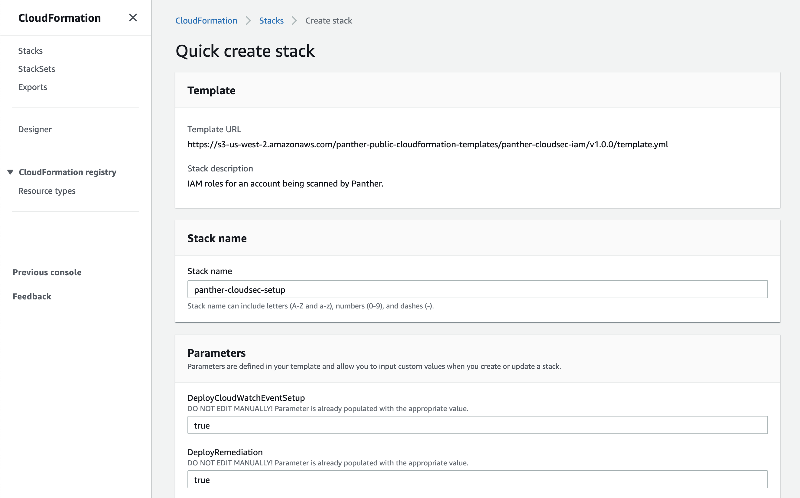
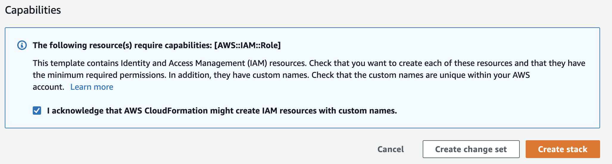
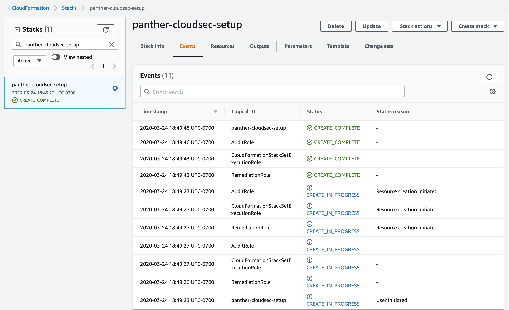
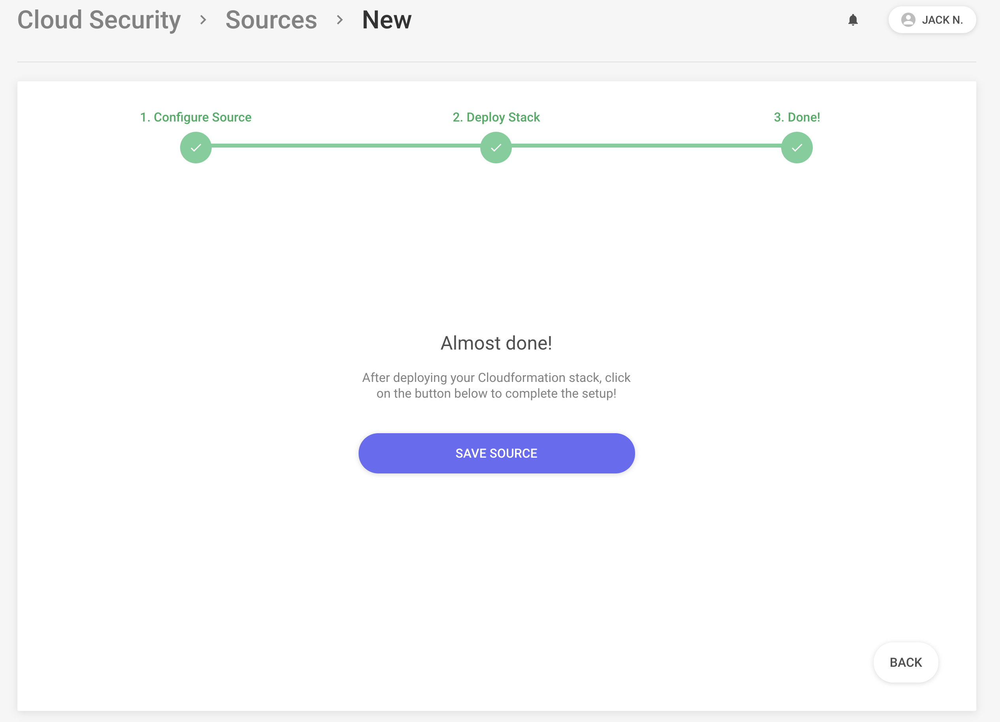
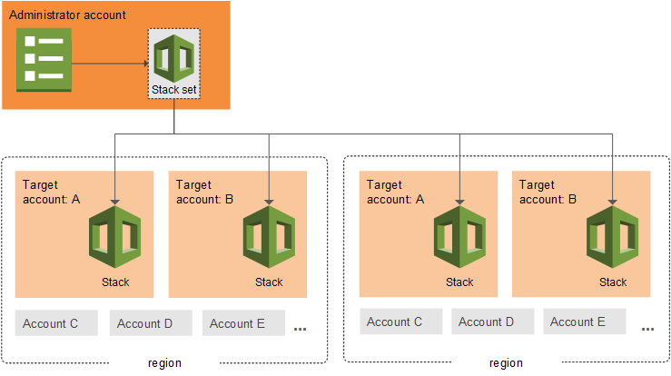
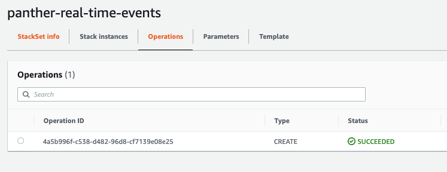

# Scanning

## How It Works

When adding a new AWS account for infrastructure monitoring, Panther first conducts a baseline scan and models resources in your account.

Resource changes are tracked in real-time and scans run daily on your account to ensure the most consistent state possible.

This functionality is enabled by creating a [ReadOnly Scan IAM Role](https://docs.aws.amazon.com/general/latest/gr/aws-security-audit-guide.html) and collecting CloudTrail or [AWS CloudWatch Events](https://docs.aws.amazon.com/AmazonCloudWatch/latest/events/WhatIsCloudWatchEvents.html) for stream real-time responses.

### Diagram



## Setup

Panther can scan as many AWS accounts as you would like.

Each resource is associated with the account's label \(Prod, Dev, Test, etc\).

## Add Your Account

The first step is adding a new AWS account source by going to `Cloud Security` > `Sources` > `Add Account`:



Enter your account `Name` and `AWS Account ID`, and then tick the boxes if you want to enable real-time scans and/or automatic remediation:



Click `Next`, and then download the generated template or click directly into the CloudFormation Console:



Clicking the `Launch Stack` button which open [CloudFormation](https://aws.amazon.com/cloudformation/) in the AWS account you are currently logged into with pre-populated stack variables:




Make sure to check the acknowledgement in the `Capabilities`box




Click the `Create stack` button. After about 15 seconds, the stack's `Status` should change to `CREATE_COMPLETE`. If there is an error creating the stack, then an IAM role with the same name may already exist in your account.



Back in the UI, click `Next`, and then `Save Source` to complete this setup:



## Real-Time Events

The next section will detail how to monitor changes to AWS resources in real-time.

### Prerequisites

To configure real-time events to Panther from multiple regions and accounts, we can use [AWS CloudFormation StackSets](https://docs.aws.amazon.com/AWSCloudFormation/latest/UserGuide/what-is-cfnstacksets.html).

The following diagram illustrates this with an example model:



### Plan Your Account Layout

In this case, the account running Panther will act as the `Administrator` account to manage stack creation and updates.

All other accounts to onboard will act as `Target` accounts to send CloudWatch logs to Panther.


The `Administrator` account may also be the `Target` account. To run and scan a single AWS account, this will always be the case, and both IAM roles are required.


### Setup Administrator Account

The Administrator account must have a StackSet IAM Admin Role, which grants permissions to manage stacks in multiple accounts. Log into the `Administrator` AWS account and click [here](https://us-west-2.console.aws.amazon.com/cloudformation/home?region=us-west-2#/stacks/create/review?templateURL=https://s3-us-west-2.amazonaws.com/panther-public-cloudformation-templates/panther-stackset-iam-admin-role/latest/template.yml&stackName=panther-stackset-iam-admin-role) to launch this stack in CloudFormation.

Alternatively, go to the CloudFormation console to create a new stack, with the following template URL:

`https://s3-us-west-2.amazonaws.com/panther-public-cloudformation-templates/panther-stackset-iam-admin-role/latest/template.yml`

This Role only has permissions to assume an IAM Role called `StackSetExecutionRole`:

```text
{
    "Version": "2012-10-17",
    "Statement": [
        {
            "Action": "sts:AssumeRole",
            "Resource": "arn:aws:iam::*:role/PantherCloudFormationStackSetExecutionRole",
            "Effect": "Allow"
        }
    ]
}
```

### Onboard Accounts

Next, real-time event consumption can be enabled by following these steps:


Make sure you have at least one AWS Account Source configured [here](aws-compliance-setup.md) with the `DeployCloudWatchEventSetup`set to`true`


1. Login to the `Administrator` account AWS Console
2. Open the [CloudFormation StackSets](https://us-west-2.console.aws.amazon.com/cloudformation/home?region=us-west-2#/stacksets) page
3. Click the `Create StackSet` button on the top right
4. Select `Template is ready`
   1. Under `Template source` select `Amazon S3 URL` and paste: `https://s3-us-west-2.amazonaws.com/panther-public-cloudformation-templates/panther-cloudwatch-events/latest/template.yml`
   2. Click `Next`
5. Name the StackSet `panther-real-time-events`
   1. In the `QueueArn` field, paste the following \(substituting the AWS account ID of the account running panther\):`arn:aws:sqs:<MASTER_ACCOUNT_REGION>:<MASTER_ACCOUNT_ID>:panther-aws-events-queue`
   2. Click `Next`
6. Under the Permissions tab, add the following:
   1. IAM admin role name: `PantherCloudFormationStackSetAdminRole-<MASTER_ACCOUNT_REGION>`
   2. IAM execution role name: `PantherCloudFormationStackSetExecutionRole-<MASTER_ACCOUNT_REGION>`
   3. Click `Next`
7. Type the AWS Account IDs of the Target Accounts in the Account numbers field, separated by commas
   1. Select `Add all regions` or a list of specific regions
   2. Set `Maximum concurrent accounts` to 5
   3. Click `Next`
8. Click `Submit` at the bottom of the page to create the StackSet

To check on the status of the StackSet, check the `Operations` tab:




Awesome! You should now have real-time CloudWatch events sending to Panther.


### Add Additional Accounts

To add more accounts to the StackSet above, use the following steps:


Make sure you have at least one AWS Account Source configured [here](aws-compliance-setup.md) with the `DeployCloudWatchEventSetup`set to`true`


1. Login to the `Administrator` account's AWS Console
2. On the [CloudFormation StackSets](https://us-west-2.console.aws.amazon.com/cloudformation/home?region=us-west-2#/stacksets) page, select the `panther-real-time-events` StackSet
3. Select the `Actions` button on the top right and select `Add new stacks to StackSet`
4. Add the new AWS account ID's into the Account numbers field, specify regions, and click through to the `Submit` button
