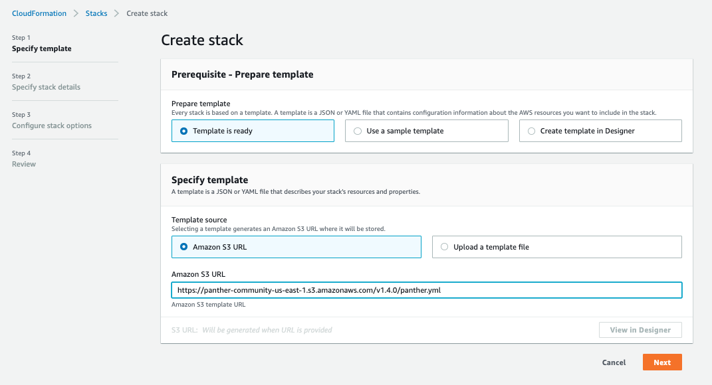

# Quick Start

## Prerequisites

What you'll need:

1. An AWS Account (see [supported regions](#supported-regions))
2. An IAM user or role with permissions to create and manage the necessary resources

We've provided a deployment role for your convenience, but any sufficiently privileged role will work:

- [AWS CloudFormation Template](https://panther-public-cloudformation-templates.s3-us-west-2.amazonaws.com/panther-deployment-role/latest/template.yml)
- [Terraform](https://github.com/panther-labs/panther/tree/master/deployments/auxiliary/terraform/panther-deployment-role.tf)


We recommend deploying Panther into its own dedicated AWS account.


## Deployment
Navigate to the AWS CloudFormation console and create a new stack.
Set the template URL to [https://panther-community.s3.amazonaws.com/v1.4.0/panther.yml](https://panther-community.s3.amazonaws.com/v1.4.0/panther.yml) like this:




Enterprise users: substitute `panther-enterprise` for `panther-community` in the template URL


On the next page, choose a stack name (e.g. "panther") and configure the name and email for the first Panther user:


This is just the initial admin user account - you can edit the user and invite additional users after Panther is deployed.
You can leave all other parameters with their default values.

On the next page, you can skip all the advanced stack settings. Acknowledge the warnings and deploy the stack!


### Using a Template

Alternatively, you can deploy Panther as a nested stack in your own CloudFormation template:

```yaml
AWSTemplateFormatVersion: 2010-09-09
Description: My Panther deployment

Resources:
  Panther:
    Type: AWS::CloudFormation::Stack
    Properties:
      TemplateURL: https://panther-community.s3.amazonaws.com/v1.4.0/panther.yml
      Parameters:
        FirstUserEmail: user@example.com
        FirstUserGivenName: Alice
        FirstUserFamilyName: Jones
```

Or, to build and deploy from source, see the [development](development.md) page.

## First Login

Once the deployment has finished, you will get an invitation email from `no-reply@verificationemail.com` with your temporary login credentials.
(If you don't see it, be sure to check your spam folder.)


By default, Panther generates a self-signed certificate, which will cause most browsers to present a warning page:


Your connection _is_ encrypted, and it's generally safe to continue. However, the warning exists because self-signed certificates do not protect you from man-in-the-middle attacks; for this reason production deployments should provide their own `CertificateArn` parameter value.


## Onboarding

Congratulations! You are now ready to use Panther. Follow the steps below to complete your setup:

1. Invite your team in `Settings` > `Users` > `Invite User`
1. Configure [destinations](destinations) to receive generated alerts
2. Onboard data for [real-time log analysis](log-analysis/log-processing/)
3. Write custom [detection rules](log-analysis/rules/) based on internal business logic
4. Onboard accounts for [cloud security scans](policies/scanning/)
5. Write [policies](policies/cloud-security-overview.md) for supported [AWS resources](policies/resources/)
6. Query collected logs with [historical search](historical-search/README.md)

## Supported Regions

Panther relies on dozens of AWS services, some of which are not yet available in every region. In particular, AppSync, Cognito, Athena, and Glue are newer services not available in us-gov, china, and other regions. At the time of writing, all Panther backend components are supported in the following:

- `ap-northeast-1` (tokyo)
- `ap-northeast-2` (seoul)
- `ap-south-1` (mumbai)
- `ap-southeast-1` (singapore)
- `ap-southeast-2` (sydney)
- `ca-central-1` (canada)
- `eu-central-1` (frankfurt)
- `eu-west-1` (ireland)
- `eu-west-2` (london)
- `us-east-1` (n. virginia)
- `us-east-2` (ohio)
- `us-west-2` (oregon)

Consult the [AWS region table](https://aws.amazon.com/about-aws/global-infrastructure/regional-product-services/) for the source of truth about service availability in each region.

## Removing Panther
To uninstall Panther, simply delete the main "panther" stack (substituting whatever stack name you chose during deployment).
This will automatically remove everything except:

* S3 buckets and their data
* A few empty CloudWatch log groups

You can easily find and delete these manually, or you can run `mage teardown` (see [development](development.md#teardown)).
